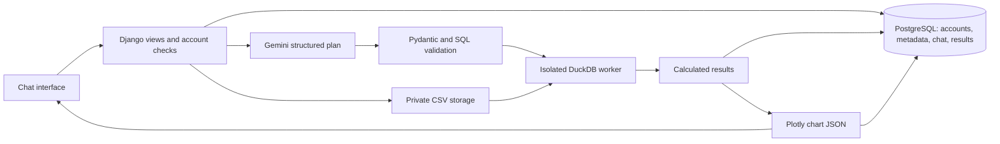
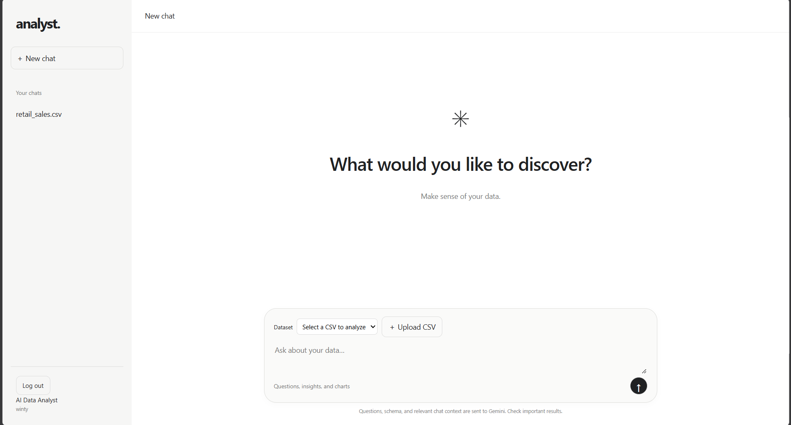
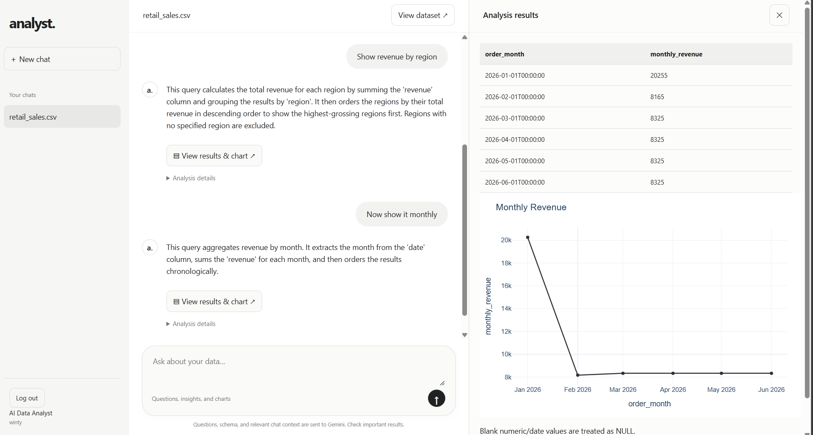

# AI Data Analyst

A conversational CSV analyst built with Django, PostgreSQL, Gemini, DuckDB, and Plotly. Ask questions in plain language, inspect calculated results, and reopen saved conversations.

## Current features

- Account signup, login, and POST-only logout using Django session authentication.
- Account-owned datasets and conversations, accessible across login sessions.
- Multiple CSV uploads, structural validation, private storage, preview, and removal.
- Full-data profiling: inferred types, missing/distinct counts, statistics, date ranges, duplicate rows.
- Structured Gemini analysis plans and clarifications, independently validated SQL, one bounded correction attempt.
- Isolated DuckDB execution with timeout, row limits, and disabled external access.
- Plotly bar, line, pie, and scatter charts; saved results and figures restore without rerunning analysis.
- Chat layout with thread navigation, loading states, and an optional data/results canvas.
- Calculated result summaries and explained 1.5 x IQR anomaly detection.

## Local setup

Python 3.12+ and PostgreSQL 14+ are recommended. From the repository root with your virtual environment activated:

```powershell
python -m pip install -r requirements-dev.txt
Copy-Item .env.example .env
python -c "from django.core.management.utils import get_random_secret_key; print(get_random_secret_key())"
```

Set SECRET_KEY to the generated value in quotes. Configure POSTGRES_DB, POSTGRES_USER, POSTGRES_PASSWORD, POSTGRES_HOST, and POSTGRES_PORT. Set GEMINI_API_KEY and GEMINI_MODEL to your available Gemini Developer API model. Secrets belong only in ignored `.env`; never share them or include them in screenshots. Environment variables override file settings.

For the development database with Docker Desktop running:

```powershell
docker compose up -d db
```

Alternatively use your local PostgreSQL installation; see [PostgreSQL setup](documents/local-postgresql.md). Do not bind both database services to the same port. Example credentials are local-development placeholders.

```powershell
python Project/manage.py migrate
python Project/manage.py runserver
```

Open http://127.0.0.1:8000/, create an account, upload `sample_data/retail_sales.csv`, and ask a question. Each new chat selects one dataset. Questions, column metadata, and bounded conversation context are sent to Gemini; raw CSV files and chart JSON are not sent by the planner. Check the provider's current free-tier data policy before using sensitive data.

## Authentication and existing data

Django hashes passwords and validates signup passwords. Session cookies and CSRF protection secure browser requests; JWT is not used. Private dataset and thread routes verify account ownership. Logout requires POST.

Old anonymous records have nullable ownership during migration. Signup or login claims only unowned datasets and conversations associated with that browser's existing session key, before login rotates it. Records from lost sessions are not automatically assigned. Account-owned data remains accessible after logout/login. Password reset/email verification and login rate limiting are not yet configured; a public deployment should add these controls.

## Architecture



## Verification

```powershell
python -m pytest -q
python -m ruff check Project
python Project/manage.py check
python Project/manage.py collectstatic --noinput
python llm_test.py
```

Automated tests mock Gemini and use isolated SQLite plus temporary files; numerical tests launch real DuckDB workers. PostgreSQL needs migrations and a `/ready/` check separately. `llm_test.py` makes a small live request, which consumes quota and can incur charges on a billed project. It does not establish remaining quota.

- `/health/`: process liveness, no database query.
- `/ready/`: PostgreSQL connectivity, not migration state.

## Demo flow and screenshots

1. Sign up or log in; show the blank new-chat workspace.
2. Upload the synthetic sample and select it in a new chat.
3. Ask 'Show revenue by region as a bar chart.' Open results in the right canvas.
4. Ask 'Now show it monthly.' Open the line chart.
5. Refresh or reopen the thread to demonstrate persisted history.

### Screenshots

**New-chat workspace** ? thread history on the left, CSV selection/upload, and the message composer.



**Conversation and data canvas** ? contextual follow-up questions, calculated monthly results, and an interactive Plotly chart.



### Demo video

The demo video link will be added once recorded. A 10?30 second walkthrough should show dataset selection, a natural-language question, a chart, and a contextual follow-up.

## Limits and remaining submission work

One dataset per conversation; cross-file joins are not implemented. SQL is a restricted flat SELECT subset. Numbers use floating-point arithmetic; missing numeric/date cells become NULL; duplicates remain included. Default worker timeout is 20 seconds, returned rows 200, and DuckDB buffer-memory limit 256 MB. That memory setting is not a process-wide bound; production requires OS/container resource controls and request/concurrency limits.

Assistant findings are deterministic summaries of computed results, accompanied by LLM-generated methodology and assumptions. This avoids a second provider call and invented numerical claims. Anomaly requests use 1.5 x IQR fences; fewer than four observations and zero-IQR columns are skipped with explanations. Flags indicate statistical outliers, not business errors.

Full application Docker support is implemented, but a runtime smoke test remains pending because Docker is unavailable in this workspace. Screenshots are included above; the demo link is pending. Forecasting, report exports, and dashboard generation remain optional future work.

## Full Docker application

With Docker Desktop running and `.env` configured:

```powershell
docker compose up --build -d
docker compose logs -f web
```

Open http://127.0.0.1:8000/. The web container waits for PostgreSQL, migrates, collects static files, and serves Gunicorn. Named volumes persist uploads and database data. This configuration is for localhost HTTP; configure TLS, secure cookies, and deployment hosts before public hosting. If local PostgreSQL already occupies port 5432, change the Compose database published port to 5433; the web service still uses db:5432. Stop a local Django server before starting the container on port 8000. `docker compose down` preserves volumes; do not use `down -v` unless deleting data intentionally.

Try 'Detect anomalies in revenue' to see flags with row numbers and thresholds. Summaries describe returned results only; truncated results are explicitly labeled.

See [implementation plan](documents/implementation-plan.md), [conversation context](documents/conversation-context.md), [DuckDB execution](documents/duckdb-execution.md), and [Plotly charts](documents/plotly-charts.md).

## Final review

The suite has 90 passing tests. See [submission checklist](documents/submission-checklist.md) and [findings and anomalies](documents/findings-and-anomalies.md). Include an additional `anomalies.png` screenshot showing flagged revenue values, thresholds, and reasons.
